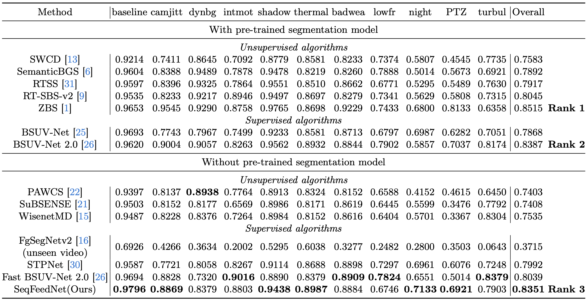
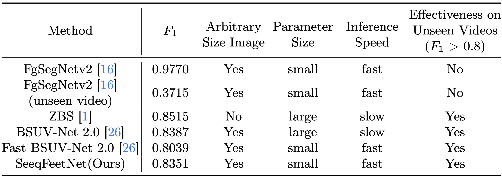
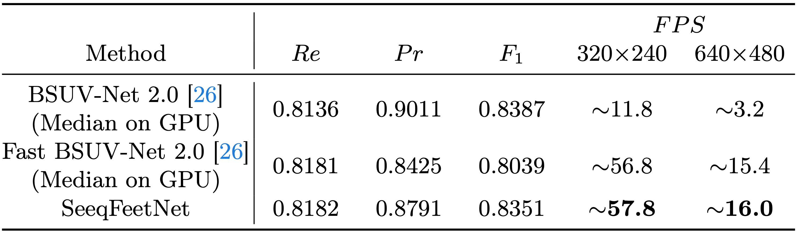
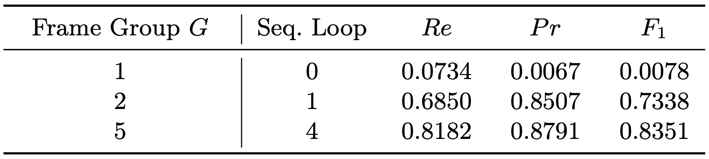

# SeqFeedNet: Sequential Feature Feedback Network for Background Subtraction

---

## Abstract

Background subtraction (BGS) is a fundamental task in computer vision with applications in video surveillance, object tracking, and people recognition. Despite recent advancements, many deep learning-based BGS algorithms rely on large models to extract high-level representations, demanding significant computational resources and leading to inefficiencies in processing video streams. To address these limitations, we introduce the Sequential Feature Feedback Network (SeqFeedNet), a novel supervised algorithm for BGS in unseen videos that operates without additional pre-processing models. SeqFeedNet innovatively incorporates time-scale diverse sequential features and employs a feedback mechanism for each iteration. Moreover, we propose the Sequential Fit Training (SeqFiT) technique, enhancing model convergence during training. Evaluated on the CDNet 2014 dataset, SeqFeedNet achieves ~5 times increase in processing speed compared to leading supervised algorithms while maintaining comparable F-fpasure scores, making it highly suitable for real-world applications. Our experiment demonstrates that SeqFeedNet surpasses state-of-the-art network without pre-trained segmentation mdoel by 3.12% F-fpasure on the CDnet 2014 dataset.

| Previous                                                   | SeqFeedNet(Porposed)                                         |
| ---------------------------------------------------------- | ------------------------------------------------------------ |
|  |  |

- The framework of SeqFeedNet.
  

## Results

- Comparison of methods according to the per-category F-Measure for unseen videos from CDnet 2014.
  
  Without the pre-trained segmentation model, SeqFeedNet achieves the best BGS on unseen videos.

- Qualitative practical demand comparison for BGS.
  

  SeqFeedNet aims to achieve all the key factors for the practical application and deployment.

- FPS is calculated using PyTorch 2.1 implementation on a single Nvidia GeForce RTX 3090 GPU.
  
  Note: ZBS was not included in the speed tests due to its higher setup costs, although it reportedly uses C++ language and reaches about 20 FPS on an A100 GPU according to its publication.

  SeqFeedNet is **~5** times faster than the best supervised BGS algorithm.

Overall, SeqFeedNet become a **leading BGS algorithm for real-world application scenarios**.

## Performance

Follow the link to download the evaluation models mention on paper:
<https://drive.google.com/drive/folders/1GljFqnQp7vxh_96-moHWdUFEdTriTvh2?usp=sharing>

- Cross-validation of overall and per-category results of SeqFeedNet on the CDnet 2014 dataset.

| Model                                                                                        | baseline | cameraJitter | badWeather | dynamicBackground | intermittentObjectMotion | lowFramerate | nightVideos | PTZ    | shadow | thermal | turbulence |     | Overall |
| -------------------------------------------------------------------------------------------- | -------- | ------------ | ---------- | ----------------- | ------------------------ | ------------ | ----------- | ------ | ------ | ------- | ---------- | --- | ------- |
| [cv1](https://drive.google.com/file/d/141c946KH4wnXTbFTpAIt05qAGWyqZAEB/view?usp=drive_link) | 0.9784   | 0.9267       | 0.8796     | 0.9314            | 0.9712                   | 0.0037       | 0.5798      | 0.1788 | 0.9304 | 0.7707  | 0.8311     |     | 0.7256  |
| [cv2](https://drive.google.com/file/d/1eJH9inr6UjtTJA_-wWZiezB05o9LT2hs/view?usp=drive_link) | 0.9739   | 0.8969       | 0.9048     | 0.6332            | 0.8415                   | 0.9477       | 0.7635      | 0.8023 | 0.9659 | 0.9436  | 0.6552     |     | 0.8480  |
| [cv3](https://drive.google.com/file/d/1U5xHNw9m00uepnQ-OQsPZAWHIaElZVBJ/view?usp=drive_link) | 0.9862   | 0.9121       | 0.8478     | 0.9681            | 0.9098                   | 0.9347       | 0.5912      | 0.8430 | 0.9537 | 0.9390  | 0.8858     |     | 0.8883  |
| [cv4](https://drive.google.com/file/d/1AkrdZhSsOoHb21OfjMBT0sZ60TlHGfzZ/view?usp=drive_link) | 0.9799   | 0.8120       | 0.9214     | 0.8186            | 0.7988                   | 0.8122       | 0.9187      | 0.9443 | 0.9250 | 0.9416  | 0.7890     |     | 0.8783  |
|                                                                                              |          |              |            |                   |                          |              |             |        |        |
| Overall                                                                                      | 0.9796   | 0.8869       | 0.8884     | 0.8379            | 0.8803                   | 0.6746       | 0.7133      | 0.6921 | 0.9438 | 0.8987  | 0.7903     |     | 0.8351  |

- Ablation
  

  The findings reveal that increasing the number of sequential loops by including additional frame groups significantly boosts the performance of SeqFeedNet.

## Installation

Test on `python 3.10`, `cuda 12.1`, and `torch 2.1.1`

```shell
pip3 install -r requirements.txt
pip3 install torch torchvision
```

## Dataset

1. Download the CDnet 2014 Dataset:
   <http://jacarini.dinf.usherbrooke.ca/static/dataset/dataset2014.zip>

2. Download the model trained using both an empty background and a recent background as provided by M. Ozan Tezcan et al. at the following link:
   <https://drive.google.com/drive/folders/1fskxV1paCsoZvqTVLjnlAdPOCHk1_XmF>

3. Prepare the folder structure as follow:

   ```shell
   Data
    ├── currentFr -> cdnet2014/dataset/
    ├── emptyBg -> BSUV-Net-2.0_Training_Data/emptyBg
    └── recentBg -> BSUV-Net-2.0_Training_Data/recentBg
   ```

## Training

```shell
cross_validation_set=<number_of_set>
python3 training.py --device 0 -epochs 200 --batch_size 9 -workers 9 -cv $cross_validation_set -imghw 224-224 -use-t2val -opt Adam -out $cross_validation_set
```

The model's weight will be saved to the `out/` directory.

## Testing

```shell
cross_validation_set=<number_of_set>

# generate measurement csv
python3 testing.py -cv $cross_validation_set --device 0 -weight <model_weight>
# generate measurement csv & video result
python3 testing.py -cv $cross_validation_set --device 0 -weight <model_weight> -save
```

## Demo

The order of the first row, from left to right, is as follows: `input`, `label`, `prediction mask(threshold=0.5)`, and `prediction probability`.
The second row displays the sequential features' visual results.

- PTZ/intermittenPan
  link: <https://drive.google.com/file/d/12-dvboDZkgFxo4dM-YxM1wBMwJJWCbB1>

<div style="position: relative; padding-bottom: 20%; height: 0; overflow: hidden;">
  <iframe src="https://drive.google.com/file/d/12-dvboDZkgFxo4dM-YxM1wBMwJJWCbB1/preview" style="position: absolute; top: 0; left: 0; width: 100%; height: 100%;" frameborder="0" allowfullscreen></iframe>
</div>
<!-- <iframe src="https://drive.google.com/file/d/12-dvboDZkgFxo4dM-YxM1wBMwJJWCbB1/preview"></iframe> -->

| No. Frame | Sequential Features                                   |
| --------- | ----------------------------------------------------- |
| 1         |  |
| 2         |  |
| 3         |  |

From Frame 1 (initialize) to Frame 3, it is obvious that the sequential features can be adapted quickly.

- shadow/peopleInShade
  link: <https://drive.google.com/file/d/1WbR_CjdeGmQn2NpPwPVL57v_eL2RmEK1/view?usp=drive_link>

<div style="position: relative; padding-bottom: 20%; height: 0; overflow: hidden;">
  <iframe src="https://drive.google.com/file/d/1WbR_CjdeGmQn2NpPwPVL57v_eL2RmEK1/preview" style="position: absolute; top: 0; left: 0; width: 100%; height: 100%;" frameborder="0" allowfullscreen></iframe>
</div>

<!-- <iframe src="https://drive.google.com/file/d/1WbR_CjdeGmQn2NpPwPVL57v_eL2RmEK1/preview"></iframe> -->

| Judgment of shadow | Results                                                 |
| ------------------ | ------------------------------------------------------- |
| As FG              |  |
| As BG              |    |

The result shows that the sequential features can divide the shadow shape to prevent misjudgment of the shadow as foreground.
